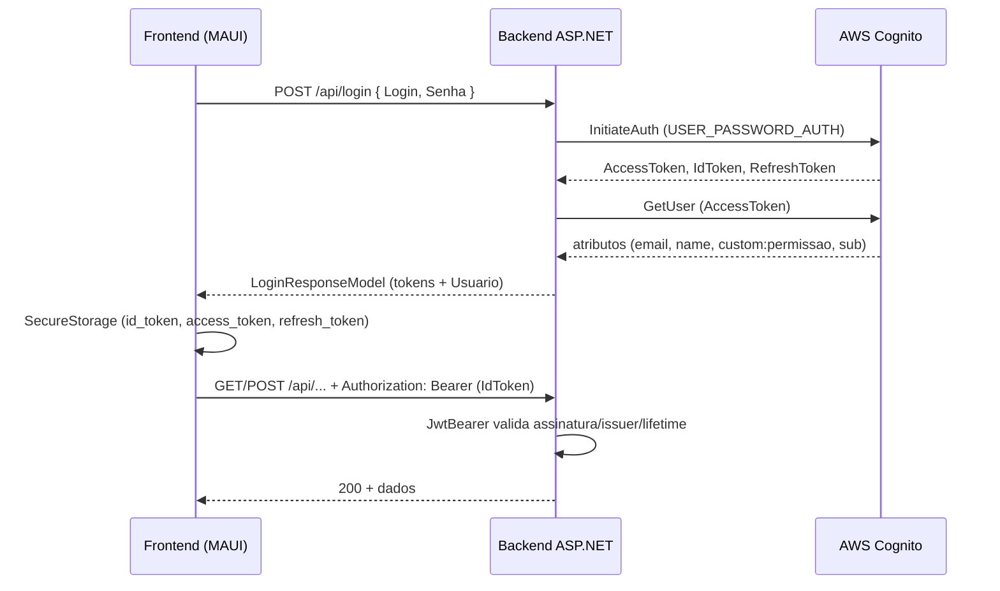

# Autenticação no CanilApp

Este documento descreve o fluxo de autenticação **como está implementado hoje** no repositório: login via **AWS Cognito**, obtenção de tokens, chamadas à API com **JWT**, validação no backend ASP.NET Core e onde entram as configurações.

---

## Visão geral (uma frase)

O **frontend (MAUI + Blazor)** envia email e senha para o **backend**, que chama o **Cognito** (`USER_PASSWORD_AUTH`), devolve **Access Token**, **ID Token** e **Refresh Token**; o app guarda o **ID Token** e o coloca no header **`Authorization: Bearer`** nas chamadas à API; o backend valida esse JWT com **JwtBearer** usando a **authority** do User Pool do Cognito.

---

## 1. Como o login funciona (Cognito)

### Passo a passo

1. O usuário preenche email e senha na UI; o `LoginViewModel` monta o corpo `{ Login, Senha }` e chama `POST api/login` com o `HttpClient` nomeado `ApiClient` (registrado em `MauiProgram.cs`).
2. O `LoginController` recebe a requisição e chama `ICognitoService.AuthenticateAsync`.
3. O `CognitoService` envia `InitiateAuthAsync` com fluxo **`USER_PASSWORD_AUTH`**, usando o **App Client ID** configurado.
4. Com o **Access Token** retornado, o serviço chama **`GetUserAsync`** para ler atributos do usuário no Cognito (`email`, `name`, **`custom:permissao`**, **`sub`**).
5. A resposta é um `LoginResponseModel` com `Token` (`TokenResponse`) e `Usuario` (`UsuarioResponseDTO`), incluindo `CognitoSub` preenchido com o `sub` do Cognito.

Referências no código:

- Controller: `Backend/Controllers/LoginController.cs` — endpoint `POST /api/login`.
- Integração Cognito: `Backend/Services/CognitoService.cs` — método `AuthenticateAsync` (fluxo `InitiateAuth` + `GetUser`).

**Requisito no Cognito:** o app client do User Pool precisa permitir o fluxo **ALLOW_USER_PASSWORD_AUTH**; caso contrário o código trata `InvalidParameterException` e devolve mensagem genérica de configuração/credenciais (ver `catch` em `CognitoService`).

---

## 2. Como o JWT é obtido

Na prática existem **três tokens** OAuth2/OIDC do Cognito:

| Token         | Onde aparece no código | Uso neste projeto |
|---------------|-------------------------|-------------------|
| **Access Token** | `TokenResponse.AccessToken` | Chamada `GetUser` no login; APIs AWS que exijam credenciais de usuário (padrão Cognito). |
| **ID Token**     | `TokenResponse.IdToken`     | **Enviado à API CanilApp** como Bearer JWT (validação no backend). |
| **Refresh Token**| `TokenResponse.RefreshToken`| Renovação via `POST /api/login/refresh`. |

Obtenção no login:

- Cognito devolve os três em `AuthenticationResult` após `InitiateAuthAsync`; o backend monta `TokenResponse` em `CognitoService.AuthenticateAsync` (`Shared/Models/TokenResponse.cs`).

Renovação:

- `LoginController` expõe `POST /api/login/refresh` com corpo `RefreshTokenRequest` (`RefreshToken`).
- `CognitoService.RefreshTokenAsync` usa `REFRESH_TOKEN_AUTH` e devolve um novo `TokenResponse` (mantendo o refresh anterior se o Cognito não enviar um novo).

Modelo compartilhado:

- `Shared/Models/TokenResponse.cs` — propriedades `AccessToken`, `RefreshToken`, `IdToken`, `ExpiresIn`.
- `Shared/Models/LoginResponseModel.cs` — `Token` + `Usuario`.

---

## 3. Como o JWT é enviado para a API

### Armazenamento no cliente

Após login bem-sucedido, o `LoginViewModel` chama `CustomAuthenticationStateProvider.MarkUserAsAuthenticated`, que delega para `AuthenticationStateService.SetAuthenticatedAsync`:

- `SecureStorage`: chaves `id_token`, `access_token`, `auth_token` (cópia do id token para compatibilidade), `refresh_token`, além de `user_email` e `user_name`.

Arquivos: `Frontend/ViewModels/LoginViewModel.cs`, `Frontend/Services/CustomAuthenticationStateProvider.cs`, `Frontend/Services/AuthenticationStateService.cs`.

### Header HTTP

O `HttpClient` `ApiClient` é configurado em `Frontend/MauiProgram.cs` com **`AuthDelegatingHandler`** encadeado (`AddHttpMessageHandler<AuthDelegatingHandler>()`).

O handler:

- **Não** adiciona `Authorization` em rotas que contêm `/api/login` (login e refresh usam só o body).
- Para as demais requisições, lê `id_token` do `SecureStorage` e define `request.Headers.Authorization = Bearer <id_token>`.

Arquivo: `Frontend/Handlers/AuthDelegatingHandler.cs`.

**Observação:** o comentário no handler indica intenção de tentar **refresh** em caso de `401`, mas o método lança `HttpRequestException` para qualquer resposta de erro **antes** de chegar ao bloco que trataria `Unauthorized`; na prática, o fluxo automático de refresh nesse trecho pode não executar como descrito nos comentários. O endpoint `POST /api/login/refresh` existe e é usado explicitamente na lógica de `TryRefreshTokenAsync` quando esse caminho é alcançado.

---

## 4. Como o backend valida o token

### Pipeline ASP.NET Core

Em `Backend/Program.cs`:

1. `AddAuthentication(JwtBearerDefaults.AuthenticationScheme).AddJwtBearer(...)` registra a autenticação JWT.
2. **`options.Authority`** aponta para `https://cognito-idp.{region}.amazonaws.com/{userPoolId}` — o middleware baixa as chaves públicas (JWKS) e valida a assinatura.
3. **`TokenValidationParameters`**:
   - `ValidateIssuer = true`, com `ValidIssuer` igual ao issuer do User Pool.
   - **`ValidateAudience = false`** (audiência do client **não** é validada explicitamente aqui; há comentário no código sobre `ClientId` como audience típica do Cognito, mas não está aplicada).
   - `ValidateLifetime = true`, `ClockSkew = 5 minutos`.

4. No pipeline da aplicação: `app.UseAuthentication()` e `app.UseAuthorization()` antes de `MapControllers()`.

### Proteção dos endpoints

Controllers de negócio usam `[Authorize]` — por exemplo `SyncController`, `MedicamentosController`, `ProdutosController`, etc. O **`LoginController`** não usa `[Authorize]` nos métodos de login/refresh (são públicos para obter o token).

Eventos úteis para diagnóstico: `OnMessageReceived`, `OnTokenValidated` (lê claim **`sub`** para log), `OnAuthenticationFailed`, `OnChallenge` — todos em `Backend/Program.cs`.

---

## 5. Identidade do usuário e “TenantId”

### O que o repositório faz hoje

- **Não há** propriedade, claim ou campo nomeado **`TenantId`** no código C# deste repositório (multi-tenant por tenant não está modelado aqui).
- O identificador estável do usuário no Cognito é o **`sub`**, exposto na API de login como **`UsuarioResponseDTO.CognitoSub`** (preenchido a partir do atributo `sub` em `CognitoService.AuthenticateAsync`).
- No backend, após validação JWT, o middleware popula `ClaimsPrincipal`; o evento `OnTokenValidated` apenas **registra em log** o `sub` (`context.Principal?.FindFirst("sub")`). **Nenhum controller analisado** lê `User` ou `TenantId` para regras de negócio — a autorização é principalmente “usuário autenticado com JWT válido”.
- No frontend, perfil local usa `Preferences` (`user_role`, `user_email`, `user_name`) preenchidos a partir da resposta do login, não a partir de parsing do JWT no cliente para o backend.

### Se no futuro existir “tenant”

Caminho usual com Cognito:

1. Definir atributo customizado (ex.: `custom:tenant_id`) no User Pool e incluí-lo no **ID token** (mapeamento de claims no app client).
2. No backend, ler `User.FindFirst("custom:tenant_id")` (ou o nome do claim gerado) após `[Authorize]`.
3. Opcionalmente, definir `ValidateAudience = true` e `ValidAudience` com o **Client ID** se quiser alinhar validação estrita com o Cognito.

---

## 6. Configurações necessárias (appsettings, perfil AWS, secrets)

### Backend (`Backend/appsettings.json`)

Chave **`AWS`** usada por `CognitoService` e pela configuração JWT em `Program.cs`:

| Chave | Função |
|--------|--------|
| `AWS:Region` | Região do Cognito (ex.: `us-east-1`). |
| `AWS:UserPoolId` | User Pool — compõe issuer/authority e logins na Identity Pool. |
| `AWS:ClientId` | App client (fluxos `USER_PASSWORD_AUTH` / `REFRESH_TOKEN_AUTH`). |
| `AWS:IdentityPoolId` | Usado em `GetTemporaryCredentialsAsync` (credenciais AWS temporárias com ID token). |

O arquivo versionado contém valores de exemplo; em produção, prefira **User Secrets**, variáveis de ambiente ou secret manager, e **não** commite IDs reais se forem sensíveis à sua política de segurança.

### Backend (`Backend/appsettings.Development.json`)

- Pode definir **`AWS:Profile`** (ex.: `"default"`) e **`AWS:Region`** — integra com a cadeia de credenciais do SDK (`AddDefaultAWSOptions` / `GetAWSOptions` em `Program.cs`).
- O **SDK da AWS** usado pelo backend para Cognito/DynamoDB costuma obter credenciais do **perfil** indicado, variáveis de ambiente ou IAM, conforme a máquina/container.

### O que não está no appsettings

- **Senhas de usuário** nunca ficam no servidor; vão só no corpo de `POST /api/login` até o Cognito.
- **Segredo do app client** não aparece no fluxo atual porque a autenticação usa fluxos baseados em usuário/senha e refresh no client público (se o app client for configurado como confidencial no futuro, aí entram secrets do client).

### Frontend

- Não há `appsettings` de Cognito no projeto MAUI: o app fala apenas com o **backend** HTTP; quem conversa com a AWS Cognito na autenticação é o **Backend**.

### Desenvolvimento: bypass de UI (não bypass de API)

`Frontend/Config/DevAuthBypass.cs` controla `SkipLogin` para o estado de autenticação **Blazor** (`AuthenticationStateService`). O comentário no arquivo deixa claro: **endpoints com `[Authorize]` no backend continuam exigindo JWT válido** mesmo com bypass de tela.

---

## Referência rápida de arquivos

| Área | Arquivo |
|------|---------|
| Registro JWT + pipeline | `Backend/Program.cs` |
| Login / refresh HTTP | `Backend/Controllers/LoginController.cs` |
| Cognito (SDK) | `Backend/Services/CognitoService.cs` |
| DTOs de token / login | `Shared/Models/TokenResponse.cs`, `Shared/Models/LoginResponseModel.cs` |
| HttpClient + handler | `Frontend/MauiProgram.cs`, `Frontend/Handlers/AuthDelegatingHandler.cs` |
| Pós-login e storage | `Frontend/ViewModels/LoginViewModel.cs`, `Frontend/Services/AuthenticationStateService.cs` |
| Config AWS | `Backend/appsettings.json`, `Backend/appsettings.Development.json` |

---

*Documento alinhado ao código do repositório na data de elaboração; se alterar fluxos (audience, multi-tenant, refresh), atualize este arquivo junto.*
